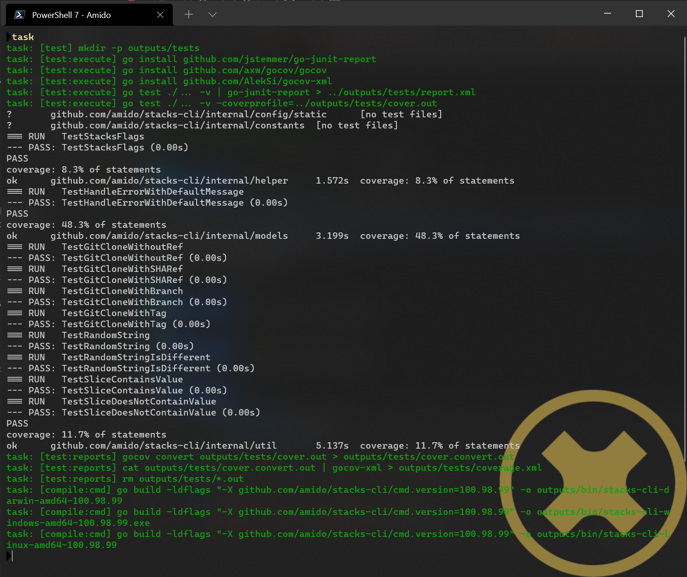

:docs_build_docker_image: russellseymour/pandoc-asciidoctor

== Building

The Stacks CLI can be built locally on a development workstation or in a CI/CD pipeline. It has been configured to use Azure DevOps, but can easily be configured to work with other CI/CD runners, such as GitLab CI and GitHub Actions.

The chapter illustrates how to get a development environment up and running and also how the CI/CD is configured.

=== Local Development

==== Install Go

.Installing Go on different platforms
[options="header"]
|===
| Platform | Package Manager | Command
| Linux | - | `wget https://golang.org/dl/go1.16.6.linux-amd64.tar.gz -O golang.tar.gz \| sudo tar -C /usr/local/ -zxf golang.tar.gz`
| Mac OS | Homebrew | `brew install go`
| Windows | Chocolatey | `choco install golang`
| Windows | Winget | `winget install -e --id GoLang.Go`
|===

==== Install Taskfile

https://taskfile.dev[Taskfile] is being used as in independent runner to build and test the code as well as generate this documentation. This means that whatever CI/CD runner is being used only needs to bootstrap the environment to run Taskfile.

Regardless of whether the CLI is being built on a local machine or in a build agent Taskfile needs to be installed.

.Installing Taskfile on different platforms
[options="header"]
|===
| Platform | Package Manager | Command
| Linux | - | `sh -c "$(curl --location \https://taskfile.dev/install.sh)" -- -d -b /usr/local/bin`
| Mac OS | Homebrew | `brew install go-task/tap/go-task`
| Windows | Chocolatey | `choco install go-task` 
|===

In the case of the Azure DevOps build file Taskfile is being downloaded directly from the release page of the project. This is so that we can control the version that is downloaded.

==== Clone the `stacks-cli` repository

Clone the repository to a location on disk, for example `C:\users\russell\workspaces\stacks\stacks-cli`.

[source,bash]
----
mkdir -p ~/workspaces/stacks
cd ~/workspaces/stacks
git clone git@github.com:amido/stacks-cli.git
----

==== Build the CLI

Building the Stacks CLI is as simple as running the default tasks using Taskfile. The default task is set to perform the following operations:

. Execute Tests
.. Run tests
.. Generate reports
. Compile
.. Create binaries for Windows, Linux and Mac OS

As this is the default task list, performing all tests and compiling the code is as simple as running one command in the stacks-cli repo directory.

[source,bash]
----
task
----

The output of the command will be similar to the following.

.Test and compile Stacks CLI

==== Build Documentation

All of the documentation for the CLI is kept in the `docs/` directory of the repository. It is all written in https://asciidoctor.org/docs/asciidoc-writers-guide/[Asciidoc] which is a much more comprehensive definition for writing documentation to Markdown.

Markdown is great for quick documentation, however by using Asciidoc it is possible to easily generate a PDF document, such as this document. There is a lot that can be done with Asciidoc, such as cross-referencing code listings and images and adding captions to the same.

It can also be used to generate Markdown files that are more easily added to static website generators, although Hugo has basic support for Asciidoc.

The Taskfile has setup with three tasks for the documentation:

. Download the Docker image for creating the documentation
. Create the PDF document
. Create the Markdown version of the files

This is run by using the command `task docs`.

====== Markdown Generation

Generating the Markdown files is a two step process, the first step is to use `asciidoctor` to generate a https://docbook.org/[Docbook] file, which is an XML definition of the document. It then uses https://pandoc.org/[Pandoc] to turn the XML into a Markdown file.

All of these steps are performed by the PowerShell script, `build/scripts/ConvertTo-Markdown.ps1`, which is shown below:

.Convert Asciidoc to Markdown
[[convert_adoc_to_md_script,{listing-caption} {counter:refnum}]]
[source,powershell,subs="attributes"]
----
include::../build/scripts/ConvertTo-Markdown.ps1[]
----

This script iterates around the `.adoc` files in the `docs/` directory and performs the conversion to XML and then MD on each one. The intended method of execution of the script is within the `{docs_build_docker_image}` Docker image. The image contains `pandoc`, `asciidoctor`, and `powershell`. The following shows and example of the Docker command executed by Taskfile.

.Executing PowerShell script for Markdown creation
[[convert_adoc_to_md_docker,{listing-caption} {counter:refnum}]]
[source,bash]
----
docker run -v ${PWD}:/data russellseymour/pandoc-asciidoctor pwsh -command /data/build/scripts/ConvertTo-Markdown.ps1 -docs_dir /data/docs/ -output_dir /data/outputs/docs/md
----

All of the markdown files are then uploaded as artefacts as part of the build.

=== Build Pipeline

A build pipeline file exists in `./build` that controls how the CLI is compiled in Azure DevOps.

The build consists of three files:

.Build files
[options="header"]
|===
| Name | Description

| `azuredevops-pipeline.yml` | Main pipeline file that AzDo uses to run the build
| `azuredevops-compile.yml` | Template file that is repeatedly called for each of the target platforms for the CLI
| `azuredevops-vars.yml` | Variable template file containing variables for the build
|===

==== Build Pipeline File

The build pipeline for Azure DevOps, `build/azuredevops-taskfile.yml`, has been configured to bootstrap the environment for Taskfile to run. These steps are as follows:

. Install specified version of Go
. Install Taskfile
. Test and Compile
.. Configure GOPATH and PATH environment variables
.. Run default task of Taskfile
.. Run docs task of Taskfile
. Upload Test results
. Upload Coverage reports
. Upload manual

All of the testing, compilation and documentation has been handled by Taskfile, the parts outside of this are to install Go and Taskfile and to upload build artefacts.

.Build steps
image::images/azdo_build_steps.png[width=300]

All of the compiled binaries, test reports and documentation are copied up to the artefact directory in Azure DevOps.

.Build aretfacts
image::images/azdo_artefacts.png[]