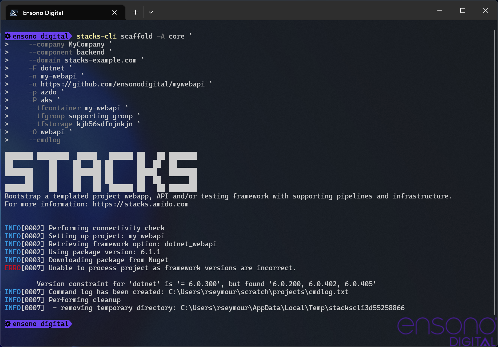

:example_company: MyCompany
:example_area: core
:example_component: backend
:example_domain: stacks-example.com
:example_cloud: azure
:example_region: ukwest
:example_group: mywebapi-resources
:example_tf_group: supporting-group
:example_tf_storage: kjh56sdfnjnkjn
:example_tf_container: tfstate
:example_project_name: my-webapi
:example_framework: dotnet
:example_framework_option: webapi
:example_framework_version: v0.0.208

== Examples

This section provides some examples on how to run the CLI to setup a project from the Amido Stacks projects.

NOTE: It is assumed that the Stacks CLI command has been installed and is in the path to be called using the `stacks` name.

The following table shows the settings that are being used in each of the examples.

.Example settings
[options="header"]
|===
| Name | Value | Description
| company | `{example_company}` | Name of the company that the project is being created for
| area | `{example_area}` | The area within the company that the project is relevant to.

In previous versions of the CLI, this has been referred to as the domain, but it has been changed to area to avoid confusion with DNS domain.
| component | `{example_component}` | Component that the project is for
| domain | `{example_domain}` | DNS domain for which the application will respond to
| cloud | `{example_cloud}` | The cloud platform being used
| region | `{example_region}` | Region in the cloud that the resources will be deployed to
| group | `{example_group}` | Group that holds all of the cloud resources
| tfgroup | `{example_tf_group}` | Group that has the resources to be used to hold the Terraform state
| tfstorage | `{example_tf_storage}` | Name of the storage that will hold the Terraform state
| tfcontainer | `{example_tf_container}` | Container in the storage for the state files
| name | `{example_project_name}` | Name of the project to create in the working directory
| framework | `{example_framework}` | Framework being used, e.g. `dotnet` or `java`
| framework_option | `{example_framework_option}` | The option within the framework being created, e.g. `webapi`, `cqrs` or `events`
| framework_version | `{example_framework_version}` | Version of the framework option to grab.
|===

=== .NET WebApi project from command line

Run the following command to create the new project in the working directory, which will be the directory that the command is being run in.

[options="header"]
[cols="a,a"]
|===
| Bash | PowerShell
|[source,bash,subs="attributes"]
----
stacks-cli scaffold -A {example_area} \
                --company {example_company} \
                --component {example_component} \
                --domain {example_domain} \
                -F dotnet \
                -n {example_project_name} \
                -p azdo \
                -P aks \
                --tfcontainer {example_project_name} \
                --tfgroup {example_tf_group} \
                --tfstorage {example_tf_storage} \
                -O {example_framework_option} \
                -V {example_framework_version} \
                --cmdlog
----
|[source,powershell,subs="attributes"]
----
stacks-cli scaffold -A {example_area} `
                --company {example_company} `
                --component {example_component} `
                --domain {example_domain} `
                -F dotnet `
                -n {example_project_name} `
                -p azdo `
                -P aks `
                --tfcontainer {example_project_name} `
                --tfgroup {example_tf_group} `
                --tfstorage {example_tf_storage} `
                -O {example_framework_option} `
                -V {example_framework_version} `
                --cmdlog
----
|===

This will get the specified version of the framework project, create a new project based on the options specified and then update the build files to work with those settings. Finally it will initalise a new git repository in the new project directory. All of the commands that have been run by the CLI will be saved in the `cmdlog.txt` file in the directory that the command was run in.

.CLI with command line options
[[example_cli_cmdline,{figure-caption} {counter:refnum}]]
image::images/example_dotnet_webapi_cmdline.png[]

<<example_cli_cmdline>> shows the output of the command running in PowerShell. It also shows the commands that have been run in the `cmdlog.txt`.

The resultant project, as stated by the `Project path:` statement in the screenshot, contains all the necessary files to run a simple .NET WebApi. The following listing shows that the solutions have been renamed with the `company` name as the namespace, as shown on lines 19, 26, 29 and 36.

[source,text,linenums]
----
└───my-webapi
    ├───.github
    ├───build
    │   └───azDevOps
    │       └───azure
    │           └───templates
    │               └───steps
    │                   └───build
    ├───contracts
    ├───deploy
    │   ├───azure
    │   │   └───app
    │   │       └───kube
    │   ├───k8s
    │   │   └───app
    │   └───scripts
    └───src
        ├───api
        │   ├───MyCompany.core.API
        │   │   ├───Authentication
        │   │   ├───Authorization
        │   │   └───Controllers
        │   │       ├───Category
        │   │       ├───DOMAIN
        │   │       └───Item
        │   ├───MyCompany.core.API.Models
        │   │   ├───Requests
        │   │   └───Responses
        │   └───MyCompany.core.API.UnitTests
        │       └───Controllers
        │           ├───Category
        │           ├───DOMAIN
        │           └───Item
        └───tests
            └───Functional
                └───MyCompany.core.API.FunctionalTests
                    ├───Builders
                    │   └───Http
                    ├───Configuration
                    ├───Models
                    └───Tests
                        ├───Fixtures
                        ├───Steps
                        └───Stories
----

=== .NET WebApi project using the interactive command

The interactive command is designed to ask questions on the command line about the configuration required for setting up Amido Stacks. It will then save this configuration out to a file that can be read in using the `scaffold` command.

[source,bash]
----
stacks-cli interactive
----

The values as specified in the previous configuration table have been used in the following screenshot of the interactive session.

The resulting configuration file contains all of the configuration that was used to generate the projects, which means it can be used to produce the same project stack again.

[source,yaml]
----
log:
  level: info
  format: text
  colour: true
directory:
  working: "C:\\Users\\RussellSeymour\\scratch\\projects"
business:
  company: My Company
  domain: core
  component: backend
cloud:
  platform: azure
network:
  base:
    domain:
      external: example-stacks.com
pipeline: azdo
project:
- name: my-webapi
  framework:
    type: dotnet
    option: webapi
    version: v208
  platform:
    type: aks
  sourcecontrol:
    type: github
    url: https://github.com/russellseymour/my-webapi
  cloud:
    region: ukwest
    group: mywebapi-resources
stacks:
  dotnet:
    webapi: https://github.com/amido/stacks-dotnet
    cqrs: https://github.com/amido/stacks-dotnet-cqrs
    events: https://github.com/amido/stacks-dotnet-cqrs-events
  java:
    webapi: https://github.com/amido/stacks-java
    cqrs: https://github.com/amido/stacks-java-cqrs
    events: https://github.com/amido/stacks-java-cqrs-events
  nodejs:
    csr: https://github.com/amido/stacks-typescript-csr
    ssr: https://github.com/amido/stacks-typescript-ssr
terraform:
  backend:
    storage: kjh56sdfnjnkjn
    group: supporting-group
    container: tfstate
options:
  cmdlog: false
  dryrun: false
  nobanner: false
----

The command that needs to be run next is displayed at the end of the output.

=== .NET WebApi project using a configuration file

The CLI can be used with a configuration file to generate the Amido Stacks based projects.

NOTE: The configuration file that is used in the following example is from the previous example. However, any valid configuration file can be used.

[source,bash]
----
stacks-cli scaffold -c ./stacks.yml
----

The CLI will use the configuration file to scaffold the requested projects.

.Scaffolding projects with a configuration file

As has been seen with using the scaffolding command with command line options, the resultant project has been created with the namespace set to the specified company name.

[source,text,linenums]
----
└───my-webapi
    ├───.github
    ├───build
    │   └───azDevOps
    │       └───azure
    │           └───templates
    │               └───steps
    │                   └───build
    ├───contracts
    ├───deploy
    │   ├───azure
    │   │   └───app
    │   │       └───kube
    │   ├───k8s
    │   │   └───app
    │   └───scripts
    └───src
        ├───api
        │   ├───MyCompany.core.API
        │   │   ├───Authentication
        │   │   ├───Authorization
        │   │   └───Controllers
        │   │       ├───Category
        │   │       ├───DOMAIN
        │   │       └───Item
        │   ├───MyCompany.core.API.Models
        │   │   ├───Requests
        │   │   └───Responses
        │   └───MyCompany.core.API.UnitTests
        │       └───Controllers
        │           ├───Category
        │           ├───DOMAIN
        │           └───Item
        └───tests
            └───Functional
                └───MyCompany.core.API.FunctionalTests
                    ├───Builders
                    │   └───Http
                    ├───Configuration
                    ├───Models
                    └───Tests
                        ├───Fixtures
                        ├───Steps
                        └───Stories
----

=== Running scaffold command again

Due to the fact that the CLI does quite a lot of work, it will not attempt to create the projects if the project path already exists. For example, running the same command as before, without changing any of the settings will result in an error being displayed during the creation of the project.

[source,bash]
----
stacks-cli scaffold -c ./stacks.yml
----

.Project protection guard

As can be seen the CLI will not overwrite anything at the same target path.

It is possible to change this behaviour, by adding the `--force` option to the command line. This will remove any existing directory and recreate the project in its place.

[source,bash]
----
stacks-cli scaffold -c ./stacks.yml --force
----

.Force removal of existng project directories

=== Checking Framework command versions

Each project that gets scaffolded by the CLI, has has `stackscli.yml` file which informs the CLI what to do for that project. One of the things that can be set is constraints on the version of the framework that needs to be installed.

For example take the following project settings file.

[source,yaml,linenums]
----
framework:
  name: dotnet
  commands:
    - name: dotnet
      version: ">= 3.1, < 3.2"

# Pipeline files
pipeline:
  - type: azdo
    files:
      - name: build
        path: build/azDevOps/azure/azure-pipelines-netcore-k8s.yml
      - name: variable
        path: build/azDevOps/azure/azuredevops-vars.yml
    replacements:
      - pattern: ^.*stacks-credentials-nonprod-kv$
        value: ""

# The init stage are things that are required to run before the template is run
init:
  operations:
    - action: cmd
      cmd: dotnet
      args: new -i .
      desc: Install "stacks-webapi" template from the repo directory
    - action: cmd
      cmd: dotnet
      args: new stacks-webapi -n {{ .Input.Business.Company }}.{{ .Input.Business.Domain }} -o {{ .Project.Directory.WorkingDir }}
      desc: Create a project using the "stacks-webapi" template
----

When the CLI runs it will take take the version constraint, on line 5, and compare the version of `dotnet` it finds with this constraint. The following screenshot shows this in action on a machine that has .NET version `5.0.303` installed.

.Dotnet command version check

It is possible to bypass this version check by using the `--force` option on the command line, but note this is a destructive operation and if the project exists at the same location as the CLI is trying to write to the original project will be deleted.

In this case the error will still be displayed, but a a warning will state that the process is continuing.

.Dotnet command bypass version check
