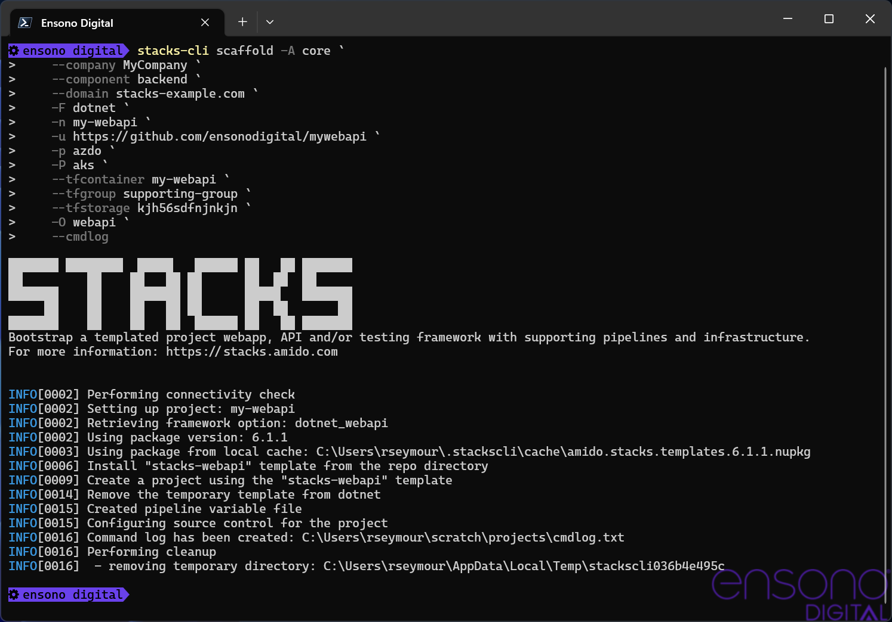

:example_company: MyCompany
:example_area: core
:example_component: backend
:example_domain: stacks-example.com
:example_cloud: azure
:example_region: ukwest
:example_group: mywebapi-resources
:example_tf_group: supporting-group
:example_tf_storage: kjh56sdfnjnkjn
:example_tf_container: tfstate
:example_project_name: my-webapi
:example_framework: dotnet
:example_framework_option: webapi
:example_framework_version: v0.0.208

== Examples

This section provides some examples on how to run the CLI to setup a project from the Amido Stacks projects.

NOTE: It is assumed that the Stacks CLI command has been installed and is in the path to be called using the `stacks` name.

The following table shows the settings that are being used in each of the examples.

.Example settings
[options="header"]
|===
| Name | Value | Description
| company | `{example_company}` | Name of the company that the project is being created for
| area | `{example_area}` | The area within the company that the project is relevant to.

In previous versions of the CLI, this has been referred to as the domain, but it has been changed to area to avoid confusion with DNS domain.
| component | `{example_component}` | Component that the project is for
| domain | `{example_domain}` | DNS domain for which the application will respond to
| cloud | `{example_cloud}` | The cloud platform being used
| region | `{example_region}` | Region in the cloud that the resources will be deployed to
| group | `{example_group}` | Group that holds all of the cloud resources
| tfgroup | `{example_tf_group}` | Group that has the resources to be used to hold the Terraform state
| tfstorage | `{example_tf_storage}` | Name of the storage that will hold the Terraform state
| tfcontainer | `{example_tf_container}` | Container in the storage for the state files
| name | `{example_project_name}` | Name of the project to create in the working directory
| framework | `{example_framework}` | Framework being used, e.g. `dotnet` or `java`
| framework_option | `{example_framework_option}` | The option within the framework being created, e.g. `webapi`, `cqrs` or `events`
| framework_version | `{example_framework_version}` | Version of the framework option to grab.
|===

=== .NET WebApi project from command line

Run the following command to create the new project in the working directory, which will be the directory that the command is being run in.

[options="header"]
[cols="a,a"]
|===
| Bash | PowerShell
|[source,bash,subs="attributes"]
----
stacks scaffold -A {example_area} \
                --company {example_company} \
                --component {example_component} \
                --domain {example_domain} \
                -F dotnet \
                -n {example_project_name} \
                -p azdo \
                -P aks \
                --tfcontainer {example_project_name} \
                --tfgroup {example_tf_group} \
                --tfstorage {example_tf_storage} \
                -O {example_framework_option} \
                -V {example_framework_version} \
                --cmdlog
----
|[source,powershell,subs="attributes"]
----
stacks scaffold -A {example_area} `
                --company {example_company} `
                --component {example_component} `
                --domain {example_domain} `
                -F dotnet `
                -n {example_project_name} `
                -p azdo `
                -P aks `
                --tfcontainer {example_project_name} `
                --tfgroup {example_tf_group} `
                --tfstorage {example_tf_storage} `
                -O {example_framework_option} `
                -V {example_framework_version} `
                --cmdlog
----
|===

This will get the specified version of the framework project, create a new project based on the options specified and then update the build files to work with those settings. Finally it will initalise a new git repository in the new project directory. All of the commands that have been run by the CLI will be saved in the `cmdlog.txt` file in the directory that the command was run in.

.CLI with command line options
[[example_cli_cmdline,{figure-caption} {counter:refum}]]

<<example_cli_cmdline>> shows the output of the command running in PowerShell. It also shows the commands that have been run in the `cmdlog.txt`.

The resultant project, as stated by the `Project path:` statement in the screenshot, contains all the necessary files to run a simple .NET WebApi. The following listing shows that the solutions have been renamed with the `company` name as the namespace, as shown on lines 19, 26, 29 and 36.

[source,text,linenums]
----
└───my-webapi
    ├───.github
    ├───build
    │   └───azDevOps
    │       └───azure
    │           └───templates
    │               └───steps
    │                   └───build
    ├───contracts
    ├───deploy
    │   ├───azure
    │   │   └───app
    │   │       └───kube
    │   ├───k8s
    │   │   └───app
    │   └───scripts
    └───src
        ├───api
        │   ├───MyCompany.core.API
        │   │   ├───Authentication
        │   │   ├───Authorization
        │   │   └───Controllers
        │   │       ├───Category
        │   │       ├───DOMAIN
        │   │       └───Item
        │   ├───MyCompany.core.API.Models
        │   │   ├───Requests
        │   │   └───Responses
        │   └───MyCompany.core.API.UnitTests
        │       └───Controllers
        │           ├───Category
        │           ├───DOMAIN
        │           └───Item
        └───tests
            └───Functional
                └───MyCompany.core.API.FunctionalTests
                    ├───Builders
                    │   └───Http
                    ├───Configuration
                    ├───Models
                    └───Tests
                        ├───Fixtures
                        ├───Steps
                        └───Stories
----

=== .NET WebApi project using the interactive mode

By running the scaffolding command in interactive mode it possible to input the configuration based on a set of questions. In addition, if the `--save` flags is specified as well the configuration is saved to a YAML file in the root of the specified working directory.

[source,bash]
----
stacks-cli scaffold -i --save
----

The values as specified in the previous configuration table have been used in the following screenshot of the interactive session.

image::images/stackscli-interactive.png[]

As the option to save the configuration has been set, the values that were put into the CLI have been saved in the `stacks.yml` file. This file contains all of the configuration that was used to generate the projects, which means it can be used to produce the same project stack again.

[source,yaml]
----
interactive: true
version: 100.98.99
log:
  level: info
  format: text
  colour: true
directory:
  workingdir: C:\Users\RussellSeymour\scratch\projects
business:
  company: MyCompany
  project: ""
  domain: core
  component: backend
cloud:
  platform: azure
  region: ""
  group: ""
network:
  base:
    domain:
      internal: ""
      external: example-stacks.com
pipeline: azdo
project:
- name: my-webapi
  framework:
    type: dotnet
    option: webapi
    version: v2.0.208
  platform:
    type: ""
  sourcecontrol:
    type: github
    url: https://github.com/russellseymour/my-webapi
    ref: ""
  settingsfile: ""
  cloud:
    platform: ""
    region: ukwest
    group: mywebapi-resources
stacks:
  dotnet:
    webapi: https://github.com/amido/stacks-dotnet
    cqrs: https://github.com/amido/stacks-dotnet-cqrs
    events: https://github.com/amido/stacks-dotnet-cqrs-events
  java:
    webapi: https://github.com/amido/stacks-java
    cqrs: https://github.com/amido/stacks-java-cqrs
    events: https://github.com/amido/stacks-java-cqrs-events
  nodejs:
    csr: https://github.com/amido/stacks-typescript-csr
    ssr: https://github.com/amido/stacks-typescript-ssr
terraform:
  backend:
    storage: kjh56sdfnjnkjn
    group: supporting-group
    container: tfstate
settingsfile: ""
options:
  cmdlog: false
  dryrun: false

----