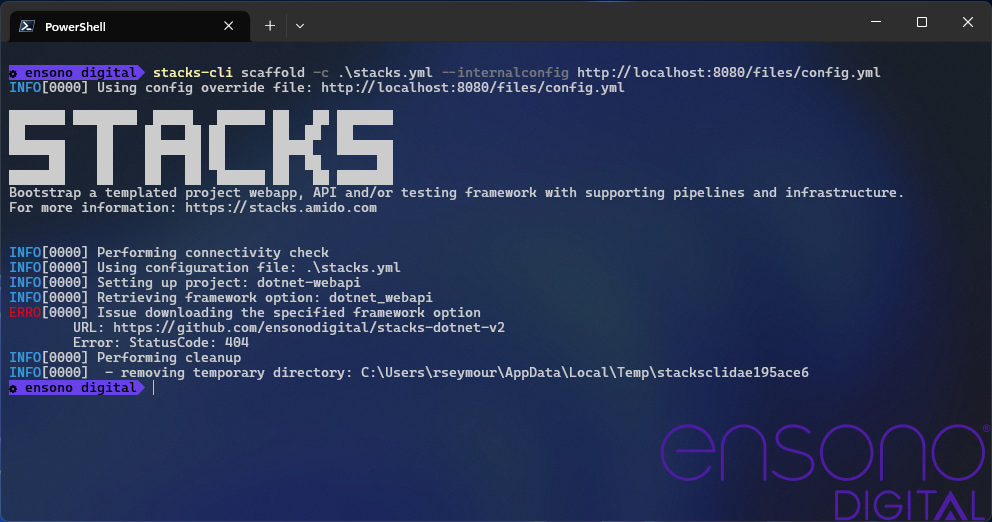

==== Using a modified internal configuration

The following YML snippet can be used to override settings in the CLI.

[source,yml]
----
stacks:
  components:
    dotnet_webapi:
      group: dotnet
      name: webapi
      package:
        url: https://github.com/ensonodigital/stacks-dotnet-v2
        type: git

    infra_data:
      group: infra
      name: data
      package:
        url: https://github.com/ensonodigital/stacks-infra-data
        type: git
----

If the above code is saved to the file `internal_config.yml` the following command can be executed.

[source,powershell]
----
stacks-cli scaffold -c ./stacks.yml --internalconfig ./internal_config.yml
----

It is possible to use a file that is hosted on the Internet by providing a URL as the value to the `--internalconfig` argument, for example.

[source,powershell]
----
stacks-cli scaffold -c ./stacks.yml --internalconfig http://localhost:8080/files/config.yml
----

NOTE: This example retrieves a file from an Nginx container running on the local workstation. The example is _not_ meant to work, rather show that the configuration being pulled from the URL is indeed overriding the internal configuration.

