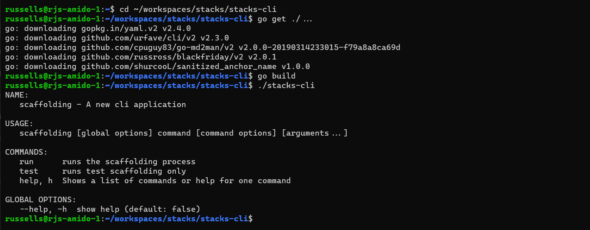

== Quick Start

This short guide will detail how to get up and running with Go and setup the local environment.

=== Install Go

.Installing Go on different platforms
|===
| Platform | Package Manager | Command
| Linux | - | `wget https://golang.org/dl/go1.16.6.linux-amd64.tar.gz -O golang.tar.gz \| sudo tar -C /usr/local/ -zxf golang.tar.gz`
| Mac OS | Homebrew | `brew install go`
| Windows | Chocolatey | `choco install golang`
| Windows | Winget | `winget install -e --id GoLang.Go`
|===

=== Clone the `stacks-cli` repository

Clone the repository to a location on disk, for example `C:\users\russell\workspaces\stacks\stacks-cli`.

[source,bash]
----
mkdir -p ~/workspaces/stacks
cd ~/workspaces/stacks
git clone git@github.com:amido/stacks-cli.git
----

=== Build the CLI

The necessary packages will be downloaded and a binary created for the platform that the command is running on. In the examples below this has been run in a PowerShell terminal and in WSL.

It is necessary to set the `GOPATH` environment variable so that the packages are installed into the correct location for app. It is recommended that the `GOPATH` is set to the parent directory of `stacks-cli`. This may cause problems if already using Go, in which case clone `stacks-cli` into the `GOPATH` already configured on the local machine.

==== PowerShell

The `GOPATH` can be set globally or for the current session. It is recommended to set it globally. In this case the `GOPATH` would be set to `C:\users\russell\workspaces\stacks`

[source,powershell]
----
cd ~/workspaces/stacks/stacks-cli
 
# Get all the package dependencies
go get ./...

# Build the application
go build
----

==== Linux (WSL)

The `GOPATH` can be set globally or for the current session. It is recommended to set it globally. In this case the `GOPATH` would be set to `~/workspaces/stacks`

[source,bash]
----
cd ~/workspaces/stacks/stacks-cli
 
# Get all the package dependencies
go get ./...

# Build the application
go build
----

The output of this will be similar to the following.

.Quickstart Output - WSL
