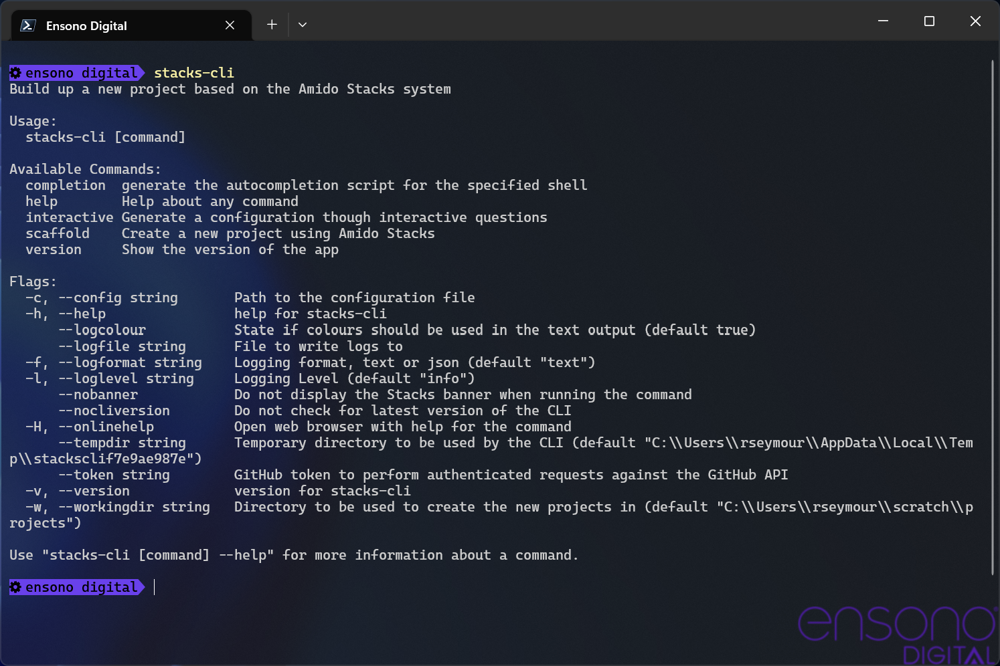
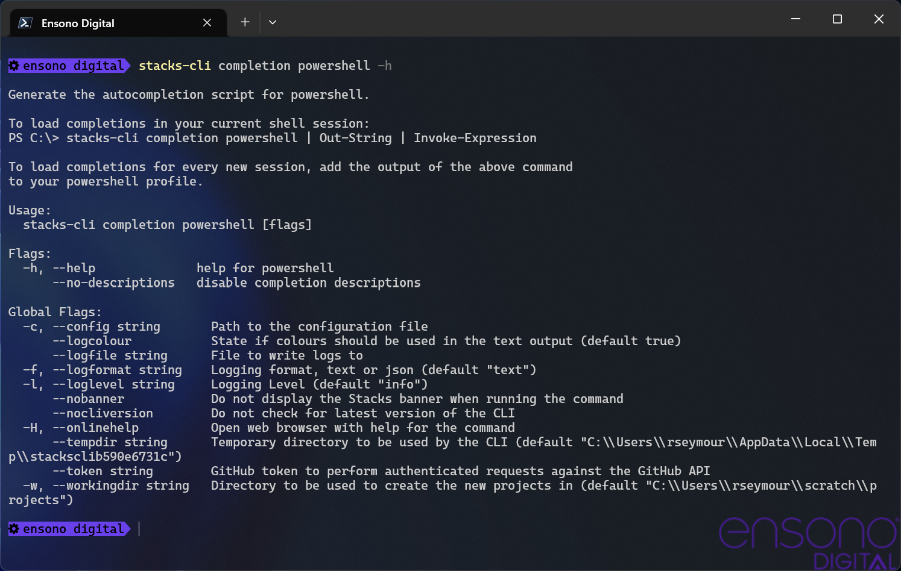
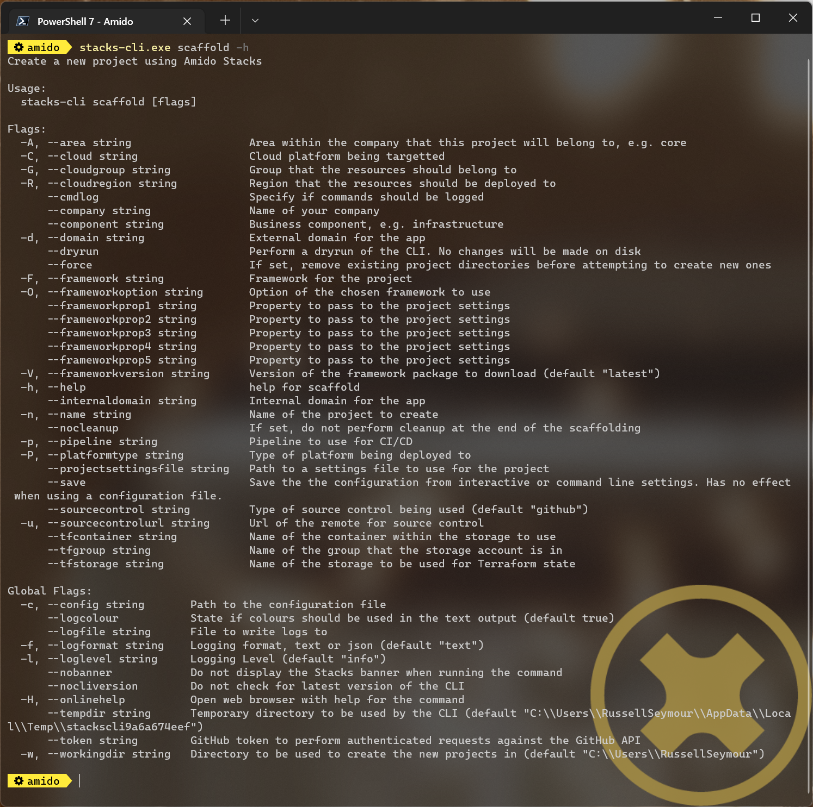
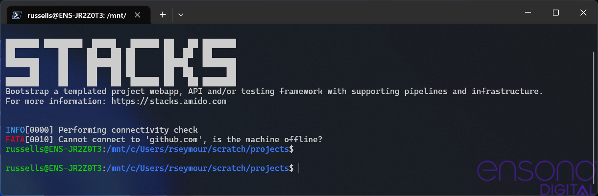

== Using the CLI

The Stacks CLI is built using Go, which means that it is a single binary which can be downloaded and run without the need to run an installer. It is currently built for the following platforms

 - icon:windows[fw] Windows
 - icon:apple[fw] Mac OS
 - icon:linux[fw] Linux

The CLI will download the specified projects and run a series of operations to customise them according to the user's requirements. The steps that are to be performed in each project is governed by a project settings file, which by default is called `stackscli.yml`.

=== Installation

As the CLI is a single binary the quickest way to install it is to download it and put it somewhere in your PATH. The following code snippets show how this can be achieved using Bash and PowerShell.

==== Linux and Mac OS
[source,bash,subs="attributes"]
----
# Download the binary to a location in the PATH
## Mac OS
wget https://github.com/amido/stacks-cli/releases/download/v{stackscli_version}/stacks-cli-darwin-amd64-{stackscli_version} -O /usr/local/bin/stacks-cli

## Linux
wget https://github.com/amido/stacks-cli/releases/download/v{stackscli_version}/stacks-cli-linux-amd64-{stackscli_version} -O /usr/local/bin/stacks-cli
----

==== Windows

The following PowerShell snippet will download the application to the user's Downloads directory. It is up to the user to put it somewhere that is accessible on the PATH or use the full path to the app when using it.

[source,powershell,subs="attributes"]
----
# Download the binary
Invoke-RestMethod -Uri https://github.com/amido/stacks-cli/releases/download/v{stackscli_version}/stacks-cli-windows-amd64-{stackscli_version}.exe -OutFile $env:USERPROFILE\Downloads\stacks-cli.exe
----

=== Commands

The CLI has a number of commands and various options. The easiest way to see what is available it to run the `stacks-cli` command, which will display the help page.

NOTE: The operation of the Stacks CLI is identical on every platform

.Stacks CLI Help

==== Completion

The completion adds completion scripts to any of the following shells:

 - bash
 - fish
 - powershell
 - zsh

By adding the completion to the shell, it allows the [TAB] key to be used to cycle through the options of any command, making discovery of options easier and increase efficiency.

The following command shows the help for configuring auto-completion for PowerShell.

[source,bash]
----
stacks-cli completion powershell -h
----

.Help page for `completion` command

As can be seen from the output, the command required to load the completion script into the current shell is displayed.

==== Interactive Command

The interactive command will ask several questions about the required projects, what platform it is being run on and cloud configuration. It will then save the output of these details to a configuration file that can then be read in by the `scaffold` command. This file can also be reused if the projects need to be recreated from scratch again.

[source,bash]
----
stacks-cli interactive
----

Please see the <<.NET WebApi project using the interactive mode>> section for an example of how this command can be used.

==== Scaffold

The `scaffold` command is the main command that will be used. This downloads the specified projects, customises them and sets them up in the specified directory. To see the help for this command run the following:

[source,bash]
----
stacks-cli scaffold -h
----

.Help page for `scaffold` command

The <<Examples>> section has a lot of examples showing how to run the Stacks CLI, the following show some simple uses of the command.

=== Command Availability Checks

Each framework has a list of commands associated with it. This denotes the list of commands that it can run during the configuration of the project.

When the application runs, it will determine the frameworks that have been selected in the projects and perform a check to see if those commands are available on the machine. It does this by checking the PATH variable for the command. This check is performed very early on in the process so it does not cause an issue when iterating around the projects that need to be setup.

NOTE: It is not possible for the Stacks project to specify the full path to the command because it can be different on each and every machine that the Stacks CLI will run on.

The commands for each of the supported frameworks are as follows:

.Framework Commands
[options="header"]
|===
| Framework | Commands
| dotnet | `dotnet`
| java | `java`
|===

If a command cannot be located, the CLI will be terminated. This does not mean the command does not exist on the machine, rather that it is not accessble using the PATH environment variable. The Stacks CLI is not a package manager and as such will not attempt to install the missing commands.

The following screenshot shows the output of a scaffolding run where the "dotnet" framework has been specified and the `dotnet` command cannot be found:

.Checking availability for framework commands

If multiple frameworks have been set, by specifying multiple projects, each framework's commands will be checked for availability.

NOTE: Although the screenshot shows the detection of the framework commands when running from a configuration file, the same checks are performed when with arguments on the command line.

