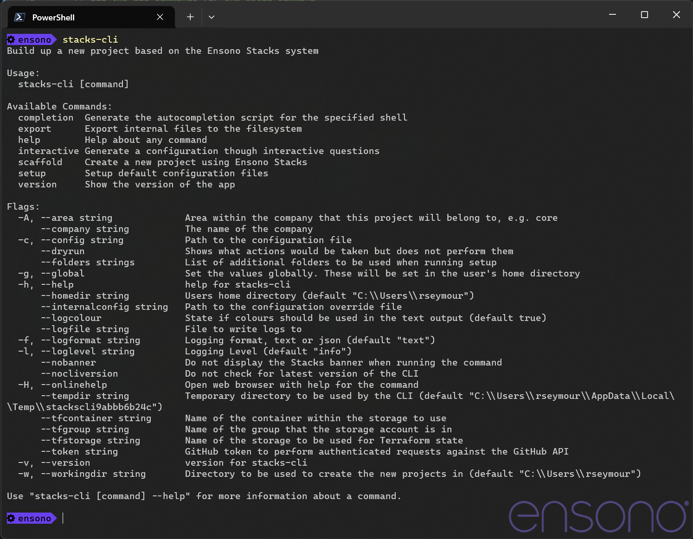

== Using the CLI

The Stacks CLI is built using Go, which means that it is a single binary which can be downloaded and run without the need for installation. It is currently built for the following platforms

 - icon:windows[fw] Windows
 - icon:apple[fw] Mac OS
 - icon:linux[fw] Linux

The CLI will download the specified projects and run a series of operations to customise them according to the user's requirements. The steps that are to be performed in each project is governed by a project settings file, which by default is called `stackscli.yml`.

=== Installation

As the CLI is a single binary the quickest way to install it is to download it and put it somewhere in your PATH. The following code snippets show how this can be achieved using Bash and PowerShell.

==== Linux and Mac OS
[source,bash,subs="attributes"]
----
# Download the binary to a location in the PATH
## Mac OS
wget https://github.com/amido/stacks-cli/releases/download/v{stackscli_version}/stacks-cli-darwin-amd64-{stackscli_version} -O /usr/local/bin/stackscli

# Linux
wget https://github.com/amido/stacks-cli/releases/download/v{stackscli_version}/stacks-cli-linux-amd64-{stackscli_version} -O /usr/local/bin/stackscli
----

==== Windows
[source,powershell,subs="attributes"]
----
# Download the binary
Invoke-RestMethod -Uri https://github.com/amido/stacks-cli/releases/download/v{stackscli_version}/stacks-cli-windows-amd64-{stackscli_version}.exe -OutFile $env:USERPROFILE\Downloads\stackscli.exe
----

=== Operation

The CLI has a couple of commands and various options. The easiest way to see what is available it to run the `stackscli` command, which will display the help page.

NOTE: The operation of the Stacks CLI is identical on every platform

.Stacks CLI Help

The `scaffold` command is the main command that will be used. This downloads the specified projects, customises them and sets them up in the specified directory. To see the help for this command run the following:

[source,bash]
----
stacks-cli scaffold -h
----

The <<Examples>> section has a lot of examples showing how to run the Stacks CLI, the following show some simple uses of the command.

==== Interactive mode

Besides the ability to specific the configuration settings on the command line or in a configuration file, the CLI has an interactive mode. This mode asks a number of questions about what should be performed. This configuration can then be optionally saved to a file so it can be used again.

[source,bash]
----
stacks-cli scaffold -i
----

.Help page for `scaffold` command
image::images/stackscli-scaffold-help.png[]

=== Command Availability Checks

Each framework has a list of commands associated with it. This denotes the list of commands that it can run during the configuration of the project.

When the application runs, it will determine the frameworks that have been selected in the projects and perform a check to see if those commands are available on the machine. It does this by checking the PATH variable for the command. This check is performed very early on in the process so it does not cause an issue when iterating around the projects that need to be setup.

NOTE: It is not possible for the Stacks project to specify the full path to the command because it can be different on each and every machine that the Stacks CLI will run on.

The commands for each of the supported frameworks are as follows:

.Framework Commands
[options="header"]
|===
| Framework | Commands
| dotnet | `dotnet`
| java | `java`
|===

If a command cannot be located, the CLI will be terminated. This does not mean the command does not exist on the machine, rather that it is not accessble using the PATH environment variable. The Stacks CLI is not a package manage and asa such will not attempt to install the missing commands.

The following screenshot shows the output of a scaffolding run where the "dotnet" framework has been specified and the `dotnet` command cannot be found:

.Checking availability for framework commands
image::images/stackscli-framework-cmd-availability.png[]

If multiple frameworks have been set, by specifying multiple projects, each framework's commands will be checked for availability.

